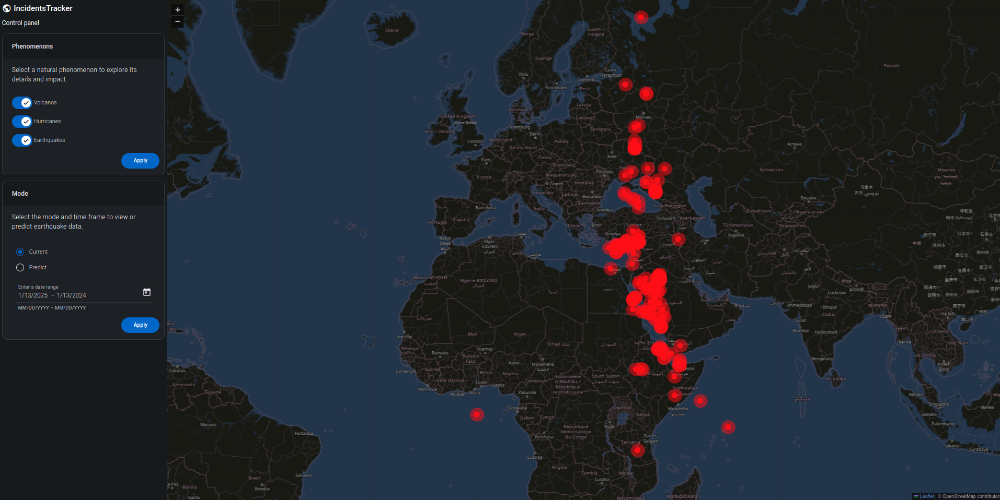

## Emergencies Tracker



**A modern Emergencies Tracking System with microservices architecture, built using F# (Giraffe) for backend services and Angular with MUI for the frontend.**

This repository provides a complete solution for tracking and visualizing emergencies, focusing on natural disasters like earthquakes and volcanoes.

---

## Run

Run single container

```
docker build -t image_name .
docker run -it -p your_port:8080 --rm --name container_name image_name
```

Run composition

```
docker compose up
```

---

## Features

### Backend (Microservices in F# with Giraffe)

1. **Earthquakes Microservice**:

   - Tracks and manages real-time data about earthquakes.
   - Provides APIs for querying earthquake-related emergencies.
   - Processes external data sources for up-to-date earthquake information.

2. **Volcanoes Microservice**:
   - Tracks volcanic activities and related emergencies.
   - Offers APIs for retrieving data on active or recent volcanic events.
   - Supports integration with geolocation services for mapping.

### Frontend (Angular with MUI)

- **User Interface**:
  - Built using Angular and Material-UI (MUI) for a modern and responsive design.
  - Visualizes data from both microservices in an intuitive dashboard.
  - Interactive charts and maps for emergencies tracking.
- **Features**:
  - Displays real-time updates on earthquakes and volcanoes.
  - Offers filtering, sorting, and search functionalities for emergency data.
  - Integrates with external APIs for enhanced visualizations (e.g., maps).

---

## Core Technologies

- **F# with Giraffe**: Functional programming for robust and maintainable backend microservices.
- **Angular**: Modern frontend framework for building fast and scalable web applications.
- **Material-UI (MUI)**: Provides a clean, user-friendly, and responsive UI for the frontend.

---

## How It Works

1. **Backend**:
   - The Earthquakes and Volcanoes microservices independently process and store their respective data.
   - Both microservices expose RESTful APIs for data retrieval.
2. **Frontend**:
   - The Angular-based frontend fetches data from the backend services via APIs.
   - Users can view, filter, and interact with emergency data on an elegant dashboard.
3. **Integration**:
   - External data sources are processed by the backend services for up-to-date emergency tracking.
   - Geolocation data is displayed on maps in the frontend for better visualization.

---

## Use Cases

- Monitor real-time natural disaster data, including earthquakes and volcanoes.
- Build scalable microservices with F# and Giraffe for functional backend development.
- Create modern web applications with Angular and MUI for data visualization and user interaction.

This repository serves as a practical example for developers interested in **microservices**, **functional programming** with F#, and building a responsive UI with **Angular** and **MUI**.
